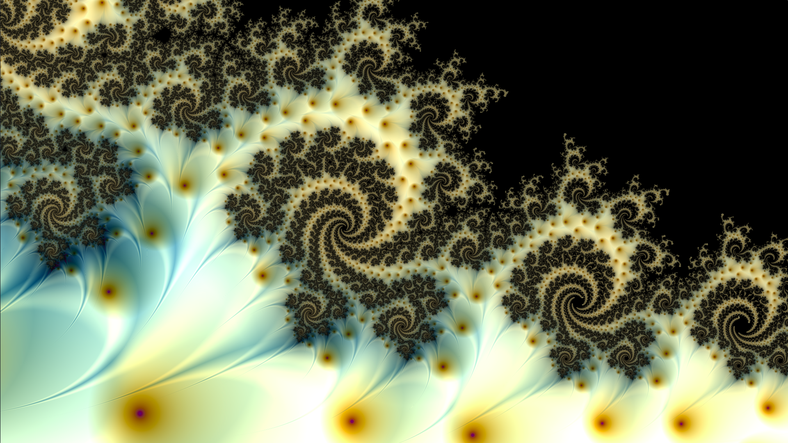

# Introduction

## Preface

The **Data-Driven Science TextBook** contains the reference material for the Data-Driven Science Lectures given at the [De Vinci Innovation Center](https://dvic.devinci.fr/).

**Data-Driven Science** is an **inter-disciplinary** field of Computer Science using scientific processes to extract knowledge from structured or unstructured data. The field concentrates on multiple hot science subfields such as **Big Data**, **Data Visualization**, **Data Sonification**, **Data Mining**, **Machine Learning**, **Deep Learning** and more.

The fundamental sciences of **Linear Algebra**, **Statistics** and **Probabilities**, **Optimization**, and **Algorithmy**  are essential to the Data-Driven Sciences. This book does not aim at covering all of those fields in detail. It provides enough material to build interest for students in the Data-Driven Science fields. In this sense, each chapter introduces the mathematical knowledge necessary to apply it to real-world applications.

**[Python 3.8](https://www.python.org/)** is chosen as the reference language in this book as it is for the moment one of the programming language of choice for Data Science, along with standard libraries such as [Numpy](https://numpy.org/), [Matplotlib](https://matplotlib.org/), and [PyTorch](https://pytorch.org/). Each discussed throughout the chapters comes with direct implementation examples.

## Author Biography

**Yliess HATI** is a Ph.D. student at the [De Vinci Innovation Center](https://dvic.devinci.fr/) (DVIC), the trans-disciplinary research lab of the [Pôle Universitaire Léonard de Vinci Paris - La Défense](https://www.devinci.fr/). He is graduated from the engineering school [ESILV](https://www.esilv.fr/) in Computer Science. His research focuses on the field of Deep Learning (DL) and, more particularly, on its use for Human-Computer Interaction (HCI) by creating interactive new experiences. He has published in academic research conferences such as the [International Conference on Auditory Display](https://icad2019.icad.org/) and [ACM SIGGRAPH European Conference on Visual Media Production](https://www.cvmp-conference.org/2019/).
